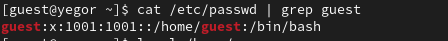

---
## Front matter
title: "Отчет по лабораторной работе №2"
subtitle: "по дисциплине: Информационная безопасность"
author: "Логинов Егор Игоревич"

## Generic otions
lang: ru-RU
toc-title: "Содержание"

## Bibliography
bibliography: bib/cite.bib
csl: pandoc/csl/gost-r-7-0-5-2008-numeric.csl

## Pdf output format
toc: true # Table of contents
toc-depth: 2
lof: true # List of figures
lot: false # List of tables
fontsize: 12pt
linestretch: 1.5
papersize: a4
documentclass: scrreprt
## I18n polyglossia
polyglossia-lang:
  name: russian
  options:
	- spelling=modern
	- babelshorthands=true
polyglossia-otherlangs:
  name: english
## I18n babel
babel-lang: russian
babel-otherlangs: english
## Fonts
mainfont: PT Serif
romanfont: PT Serif
sansfont: PT Sans
monofont: PT Mono
mainfontoptions: Ligatures=TeX
romanfontoptions: Ligatures=TeX
sansfontoptions: Ligatures=TeX,Scale=MatchLowercase
monofontoptions: Scale=MatchLowercase,Scale=0.9
## Biblatex
biblatex: true
biblio-style: "gost-numeric"
biblatexoptions:
  - parentracker=true
  - backend=biber
  - hyperref=auto
  - language=auto
  - autolang=other*
  - citestyle=gost-numeric
## Pandoc-crossref LaTeX customization
figureTitle: "Рис."
tableTitle: "Таблица"
listingTitle: "Листинг"
lofTitle: "Список иллюстраций"
lotTitle: "Список таблиц"
lolTitle: "Листинги"
## Misc options
indent: true
header-includes:
  - \usepackage{indentfirst}
  - \usepackage{float} # keep figures where there are in the text
  - \floatplacement{figure}{H} # keep figures where there are in the text
---

# Цели работы

Получение практических навыков работы в консоли с атрибутами файлов, закрепление теоретических основ дискреционного разграничения доступа в современных системах с открытым кодом на базе ОС Linux.

# Задание

1. Создать новую учетную запись guest.

2. Выполнить ряд операций в новой учетной записи.

3. Сформировать таблицу "Установленные права и разрешенные действия".

4. Сформировать таблицу "Минимальные права для совершения операций".

# Теоретическое введение

- Операционная система — это комплекс программ, предназначенных для управления ресурсами компьютера и организации взаимодействия с пользователем [@system].

- Права доступа определяют, какие действия конкретный пользователь может или не может совершать с определенным файлами и каталогами. С помощью разрешений можно создать надежную среду — такую, в которой никто не может поменять содержимое ваших документов или повредить системные файлы. [@root].

# Выполнение лабораторной работы

1. В установленной при выполнении предыдущей лабораторной работы операционной системе создал учётную запись пользователя guest (использую учётную запись администратора). Задал пароль для пользователя guest (рис. @fig:01):

{#fig:01 width=90%}

2. Вошёл в систему от имени пользователя guest. 
Определил директорию, в которой нахожусь, командой $pwd$. Она оказалась домашней (рис. @fig:02):

{#fig:02 width=90%}

3. Уточнил имя пользователя, его группу, а также группы, куда входит пользователь, командой id. Выведенные значения uid, gid и др. запомнил. Сравнил вывод id с выводом команды groups (рис. @fig:03, @fig:04):

{#fig:03 width=90%}

{#fig:04 width=90%}

4. Просмотрел файл /etc/passwd командой $cat /etc/passwd$
Нашёл в нём свою учётную запись. Определил uid, gid пользователя (рис. @fig:05, @fig:06):
 
{#fig:05 width=90%}

{#fig:06 width=90%}

Значения совпали со значениями из предыдущих пунктов

5. Определил существующие в системе директории командой
    $ls -l /home/$ (рис. @fig:07):

{#fig:07 width=90%}

Удалось получить список поддиректорий директории /home. На обеих директориях установлены права drwx------.

1. Проверил, какие расширенные атрибуты установлены на поддиректориях, находящихся в директории /home, командой:
$lsattr /home$. (рис. @fig:08):

{#fig:08 width=90%}

Не удалось увидеть расширенные атрибуты директории, так как отказано в доступе.

7. Создал в домашней директории поддиректорию dir1 командой
mkdir dir1
Определил командами ls -l и lsattr, какие права доступа и расширенные атрибуты были выставлены на директорию dir1 (рис. @fig:09):

{#fig:09 width=90%}

9. Снял с директории dir1 все атрибуты командой
chmod 000 dir1
и проверил с её помощью правильность выполнения команды
ls -l

Попытался создать в директории dir1 файл file1 командой
echo "test" > /home/guest/dir1/file1

Я получил отказ в выполнении операции по созданию файла, так как до этого убрал права на все действия по отношению к данной директории (рис. @fig:10): 

{#fig:10 width=90%}

1.  Заполнил таблицу «Установленные права и разрешённые действия» выполняя действия от имени владельца директории (файлов), определив опытным путём, какие операции разрешены, а какие нет.
Если операция разрешена, занёс в таблицу знак «+», если не разрешена, знак «-» (рис. @fig:11, @fig:12):

{#fig:11 width=90%}

{#fig:12 width=90%}

12. На основании заполненной таблицы определил те или иные минимально необходимые права для выполнения операций внутри директории dir1 (рис. @fig:13):

{#fig:13 width=90%}

# Выводы

В ходе лабораторной работы нам удалось:

Получить практические навыки работы в консоли с атрибутами файлов, закрепить теоретические основы дискреционного разграничения доступа в современных системах с открытым кодом на базе ОС Linux.

# Список литературы

::: {#refs}
:::
