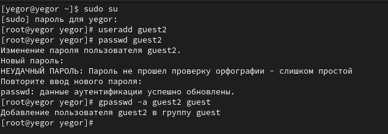
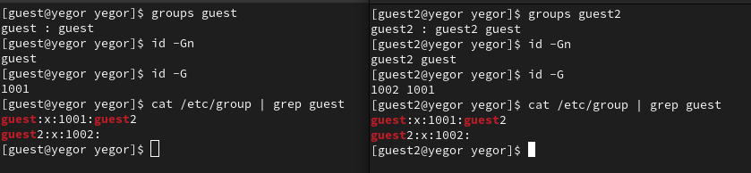
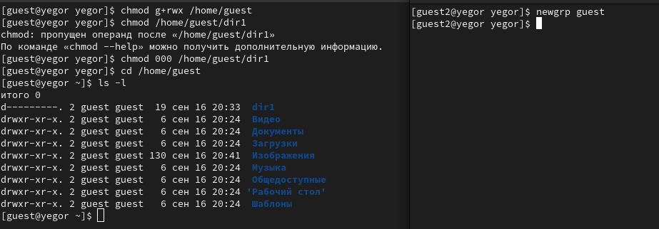
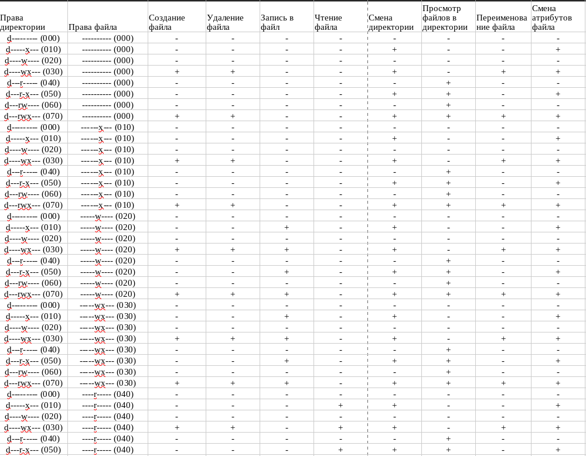
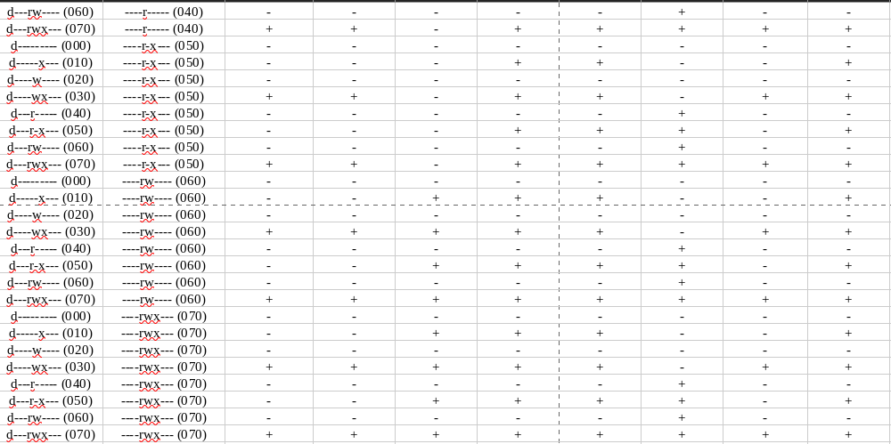
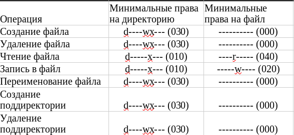

---
## Front matter
lang: ru-RU
title: Лабораторная работа №3
subtitle: Дискреционное разграничение прав в Linux. Два пользователя
author:
  - Логинов Егор Игоревич
institute:
  - Российский университет дружбы народов, Москва, Россия
date: 16 сентября 2023

## i18n babel
babel-lang: russian
babel-otherlangs: english

## Formatting pdf
toc: false
toc-title: Содержание
slide_level: 2
aspectratio: 169
section-titles: true
theme: metropolis
header-includes:
 - \metroset{progressbar=frametitle,sectionpage=progressbar,numbering=fraction}
 - '\makeatletter'
 - '\beamer@ignorenonframefalse'
 - '\makeatother'
---

# Информация

## Докладчик

:::::::::::::: {.columns align=center}
::: {.column width="70%"}

  * Логинов Егор Игоревич
  * студент НФИбд-01-20
  * Российский университет дружбы народов
  * [1032201661@pfur.ru](mailto:1032201661@pfur.ru)
  * <https://github.com/Y0gu4t>

:::
::::::::::::::

# Вводная часть

## Актуальность

Логические объекты файловой системы (файлы) являются носителями своеобразных меток, которые привычно называют правами доступа. Некоторые метки действительно означают право выполнения определенного действия пользователя над этим объектом. Важно изучить их для дальнейшего применения на практике.

## Объект и предмет исследования

- Атрибуты файлов
- Дистрибутив Rocky
- Дискреционное разграничение доступа

## Цели и задачи

Получение практических навыков работы в консоли с атрибутами файлов, закрепление теоретических основ дискреционного разграничения доступа в современных системах с открытым кодом на базе ОС Linux.

## Выполнение работы

1. Cоздал учётную запись пользователя guest2, используя учётную запись администратора. Задал пароль для пользователя guest2. Добавил пользователя guest2 в группу guest.

{#fig:01 width=50%}

## Выполнение работы

2. Вошёл в систему от имени пользователей guest и guest2. 
Определил директорию, в которой нахожусь, командой $pwd$. Она оказалась домашней.

{#fig:02 width=50%}

## Выполнение работы

3. Уточнил имя пользователя, его группу, кто входит в неё и к каким группам принадлежит он сам.

{#fig:03 width=50%}

## Выполнение работы

4. От имени пользователя guest2 выполним регистрацию пользователя guest2 в группе guest.

{#fig:04 width=50%}

## Установленные права и разрешённые действия

5. Заполнил таблицу «Установленные права и разрешённые действия»

{#fig:05 width=40%}

## Установленные права и разрешённые действия

{#fig:06 width=40%}

## Минимально необходимые права

На основании заполненной таблицы определил минимально необходимые права для выполнения операций внутри директории dir1

{#fig:07 width=50%}

## Вывод

В ходе лабораторной работы нам удалось:

- Получить практические навыки работы в консоли с атрибутами файлов
- Закрепить теоретические основы дискреционного разграничения доступа в современных системах с открытым кодом на базе ОС Linux.

