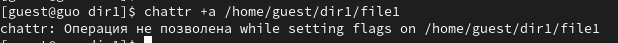
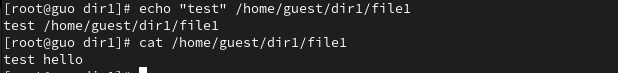
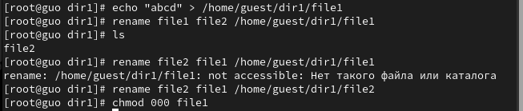

---
## Front matter
lang: ru-RU
title: Лабораторная работа №4
subtitle: Дискреционное разграничение прав в Linux.  Расширенные атрибуты
author:
  - Го Чаопэн
institute:
  - Российский университет дружбы народов, Москва, Россия
date: 30 сентября 2023

## i18n babel
babel-lang: russian
babel-otherlangs: english

## Formatting pdf
toc: false
toc-title: Содержание
slide_level: 2
aspectratio: 169
section-titles: true
theme: metropolis
header-includes:
 - \metroset{progressbar=frametitle,sectionpage=progressbar,numbering=fraction}
 - '\makeatletter'
 - '\beamer@ignorenonframefalse'
 - '\makeatother'
---

# Информация

## Докладчик

:::::::::::::: {.columns align=center}
::: {.column width="70%"}

  * Го Чаопэн
  * студент НФИбд-02-20
  * Российский университет дружбы народов
  * [1032194919@pfur.ru](mailto:1032194919@pfur.ru)
  * <https://github.com/LIONUCKY>

:::
::::::::::::::

# Вводная часть

## Актуальность

Логические объекты файловой системы (файлы) являются носителями своеобразных меток, которые привычно называют правами доступа. Некоторые метки действительно означают право выполнения определенного действия пользователя над этим объектом. Важно изучить их для дальнейшего применения на практике.

## Объект и предмет исследования

- Атрибуты файлов
- Дистрибутив Rocky
- Дискреционное разграничение доступа

## Цели и задачи

Получение практических навыков работы в консоли с расширенными атрибутами файлов.

## Выполнение работы

От имени пользователя guest определим расширенные атрибуты файла /home/guest/dir1/file1. Установим на файл file1 права, разрешающие чтение и запись для владельца файла

{#fig:001 width=90%}

## Выполнение работы

Попробуем установить на файл /home/guest/dir1/file1 расширенный атрибут a от имени пользователя guest

{#fig:002 width=90%}

## Выполнение работы

Откроем еще одну консоль с правами администратора. Установим на файл /home/guest/dir1/file1 расширенный атрибут a

{#fig:003 width=90%}

## Выполнение работы

От пользователя guest проверим правильность установления атрибута

{#fig:004 width=90%}

## Выполнение работы

Выполним дозапись в файл file1 слова «test» и выполним чтение файла file1

{#fig:005 width=90%}

## Выполнение работы

Попробуем стереть имеющуюся в файле информацию и переименовать его

{#fig:006 width=90%}

## Выполнение работы

Попробуем установить на файл file1 права, запрещающие чтение и запись для владельца файла. Этого сделать не удалось

{#fig:007 width=90%}

## Выполнение работы

Снимем расширенный атрибут a с файла /home/guest/dirl/file1 от
имени суперпользователя

{#fig:008 width=90%}

## Выполнение работы

Повторим операции, которые нам ранее не удавалось выполнить. Теперь все операции выполняются

{#fig:009 width=90%}

## Выполнение работы

Повторим действия по шагам, заменив атрибут «a» атрибутом «i»

{#fig:010 width=90%}

## Вывод

В ходе лабораторной работы нам удалось получить практические навыки работы в консоли с расширенными атрибутами файлов. «а» и «i».

