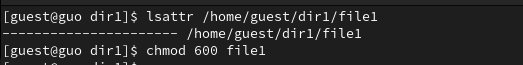
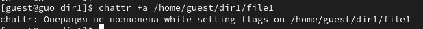
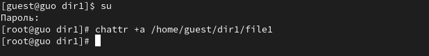
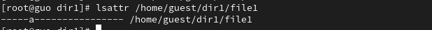
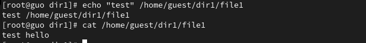
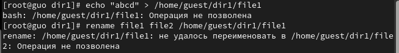
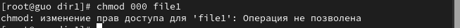
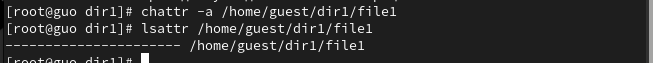
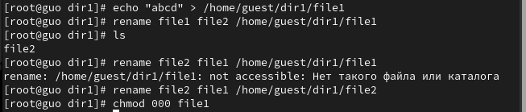
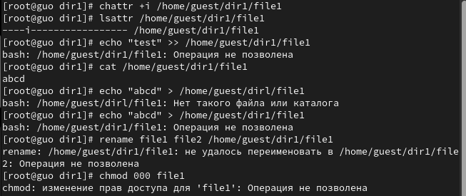

---
## Front matter
title: "Отчет по лабораторной работе №4"
subtitle: "по дисциплине: Информационная безопасность"
author: "Го Чаопэн"

## Generic otions
lang: ru-RU
toc-title: "Содержание"

## Bibliography
bibliography: bib/cite.bib
csl: pandoc/csl/gost-r-7-0-5-2008-numeric.csl

## Pdf output format
toc: true # Table of contents
toc-depth: 2
lof: true # List of figures
lot: false # List of tables
fontsize: 12pt
linestretch: 1.5
papersize: a4
documentclass: scrreprt
## I18n polyglossia
polyglossia-lang:
  name: russian
  options:
	- spelling=modern
	- babelshorthands=true
polyglossia-otherlangs:
  name: english
## I18n babel
babel-lang: russian
babel-otherlangs: english
## Fonts
mainfont: PT Serif
romanfont: PT Serif
sansfont: PT Sans
monofont: PT Mono
mainfontoptions: Ligatures=TeX
romanfontoptions: Ligatures=TeX
sansfontoptions: Ligatures=TeX,Scale=MatchLowercase
monofontoptions: Scale=MatchLowercase,Scale=0.9
## Biblatex
biblatex: true
biblio-style: "gost-numeric"
biblatexoptions:
  - parentracker=true
  - backend=biber
  - hyperref=auto
  - language=auto
  - autolang=other*
  - citestyle=gost-numeric
## Pandoc-crossref LaTeX customization
figureTitle: "Рис."
tableTitle: "Таблица"
listingTitle: "Листинг"
lofTitle: "Список иллюстраций"
lotTitle: "Список таблиц"
lolTitle: "Листинги"
## Misc options
indent: true
header-includes:
  - \usepackage{indentfirst}
  - \usepackage{float} # keep figures where there are in the text
  - \floatplacement{figure}{H} # keep figures where there are in the text
---

# Цели работы

  Получение практических навыков работы в консоли с расширенными атрибутами файлов.

# Задание

1. Исследовать доступность команд при установленном расширенном aтрибуте a.

2. Исследовать доступность команд при установленном расширенном aтрибуте i.

# Теоретическое введение

- Операционная система — это комплекс программ, предназначенных для управления ресурсами компьютера и организации взаимодействия с пользователем [@system].

- Права доступа определяют, какие действия конкретный пользователь может или не может совершать с определенным файлами и каталогами. С помощью разрешений можно создать надежную среду — такую, в которой никто не может поменять содержимое ваших документов или повредить системные файлы. [@root].

# Выполнение лабораторной работы

1. От имени пользователя guest определим расширенные атрибуты файла /home/guest/dir1/file1. Установим на файл file1 права, разрешающие чтение и запись для владельца файла (@fig:001).

{#fig:001 width=90%}

2. Попробуем установить на файл /home/guest/dir1/file1 расширенный атрибут a от имени пользователя guest (@fig:002).

{#fig:002 width=90%}

3. Откроем еще одну консоль с правами администратора. Установим на файл /home/guest/dir1/file1 расширенный атрибут a (@fig:003).

{#fig:003 width=90%}

5. От пользователя guest проверим правильность установления атрибута (@fig:004).

{#fig:004 width=90%}

6.  Выполним дозапись в файл file1 слова «test» и выполним чтение файла file1 (@fig:005).

{#fig:005 width=90%}

7. Попробуем стереть имеющуюся в файле информацию и переименовать его(@fig:006).

{#fig:006 width=90%}

8. Попробуем установить на файл file1 права, запрещающие чтение и запись для владельца файла. Этого сделать не удалось(@fig:007).

{#fig:007 width=90%}

9. Снимем расширенный атрибут a с файла /home/guest/dirl/file1 от
имени суперпользователя (@fig:008).

{#fig:008 width=90%}

10. Повторим операции, которые нам ранее не удавалось выполнить. Теперь все операции выполняются (@fig:009).

{#fig:009 width=90%}

11. Повторим действия по шагам, заменив атрибут «a» атрибутом «i» (@fig:010).

{#fig:010 width=90%}

# Выводы

В ходе лабораторной работы нам удалось получить практические навыки работы в консоли с расширенными атрибутами файлов. «а» и «i».

# Список литературы

::: {#refs}
:::
