---
## Front matter
lang: ru-RU
title: Лабораторная работа №5
subtitle: Дискреционное разграничение прав в Linux. Исследование влияния дополнительных атрибутов
author:
  - Логинов Егор Игоревич
institute:
  - Российский университет дружбы народов, Москва, Россия
date: 7 октября 2023

## i18n babel
babel-lang: russian
babel-otherlangs: english

## Formatting pdf
toc: false
toc-title: Содержание
slide_level: 2
aspectratio: 169
section-titles: true
theme: metropolis
header-includes:
 - \metroset{progressbar=frametitle,sectionpage=progressbar,numbering=fraction}
 - '\makeatletter'
 - '\beamer@ignorenonframefalse'
 - '\makeatother'
---

# Информация

## Докладчик

:::::::::::::: {.columns align=center}
::: {.column width="70%"}

  * Логинов Егор Игоревич
  * студент НФИбд-01-20
  * Российский университет дружбы народов
  * [1032201661@pfur.ru](mailto:1032201661@pfur.ru)
  * <https://github.com/Y0gu4t>

:::
::::::::::::::

## Вводная часть

## Актуальность

Логические объекты файловой системы (файлы) являются носителями своеобразных меток, которые привычно называют правами доступа. Некоторые метки действительно означают право выполнения определенного действия пользователя над этим объектом. Важно изучить их для дальнейшего применения на практике.

## Объект и предмет исследования

- Атрибуты файлов
- Дистрибутив Rocky
- Дискреционное разграничение доступа

## Цели и задачи

Изучение механизмов изменения идентификаторов, применения SetUID- и Sticky-битов. Получение практических навыков работы в консоли с дополнительными атрибутами. Рассмотрение работы механизма смены идентификатора процессов пользователей, а также влияние бита Sticky на запись и удаление файлов.

# Выполнение работы

## Создание программы

От имени пользователя guest создадим программу simpleid.c, скомпилируем ее и убедимся, что файл создан. Выполним команды ./simpleid и id и убедимся, что полученные данные совпадают

{#fig:001 width=90%}

## Создание программы

Усложним программу и запишем ее в файл simpleid2.c. Запустим получившуюся программу

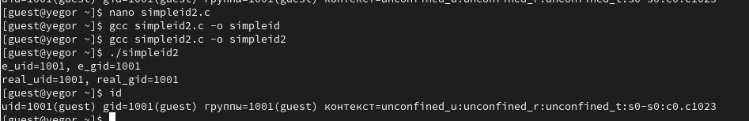{#fig:002 width=90%}

## Создание программы

От имени суперпользователя установим новые атрибуты и сменим владельца файла simpleid2

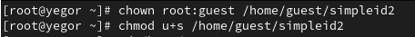{#fig:003 width=90%}

## Создание программы

Выполним команду ./simpleid2

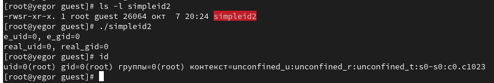{#fig:004 width=90%}

## Создание программы

Проделаем то же самое относительно SetGID-бита

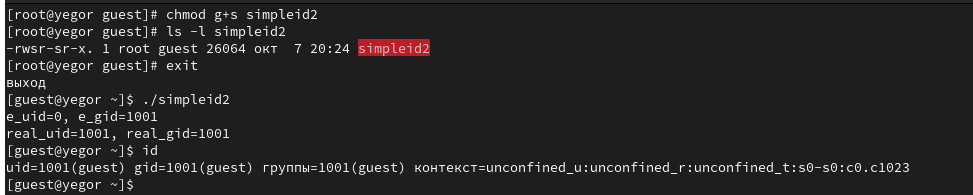{#fig:005 width=90%}

## Создание программы

Создадим и скомпилируем программу readfile.c. Сменим владельца у файла readfile.c и изменим права так, чтобы только суперпользователь (root) мог прочитать его, a guest не мог

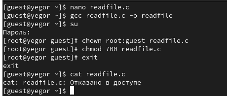{#fig:006 width=90%}

 Пользователь guest не может прочитать файл readfile.c

## Создание программы

Сменим у программы readfile владельца и установим SetUID-бит

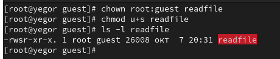{#fig:07 width=90%}

## Создание программы

Проверим, может ли программа readfile прочитать файл readfile.c

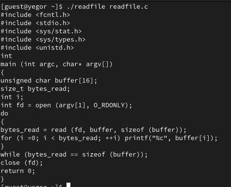{#fig:008 width=90%}

## Создание программы

Проверим, может ли программа readfile прочитать файл /etc/shadow

{#fig:009 width=90%}

## Исследование Sticky-бита

Выясним, установлен ли атрибут Sticky на директории /tmp

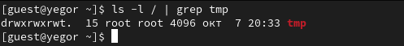{#fig:010 width=70%}

## Исследование Sticky-бита

От имени пользователя guest создадим файл file01.txt в директории /tmp
со словом test. Просмотрим атрибуты у только что созданного файла и разрешим чтение и запись для категории пользователей «все остальные»

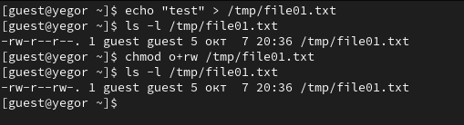{#fig:011 width=90%}

## Исследование Sticky-бита

От пользователя guest2 попробуем прочитать файл /tmp/file01.txt. Далее попробуем дозаписать в файл /tmp/file01.txt слово test2, записать в файл /tmp/file01.txt слово test3, стерев при этом всю имеющуюся в файле информацию. После этого попробуем удалить данных файл

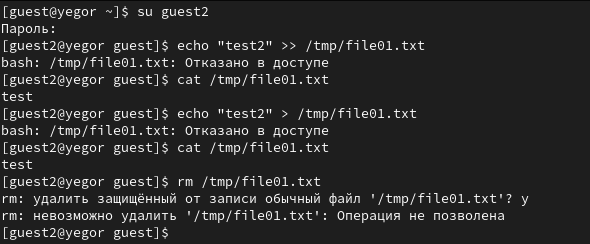{#fig:012 width=90%}

Пользователь guest2 принадлежит группе guest, поэтому у него нет доступа к вышеописанным действиям, так как у группы нет права доступа на запись для данного файла.

## Исследование Sticky-бита

От имени суперпользователя снимем атрибут t с директории /tmp. От пользователя guest2 проверим, что атрибута t у директории /tmp нет. Повторим предыдущие шаги. Теперь мы можем удалить файл

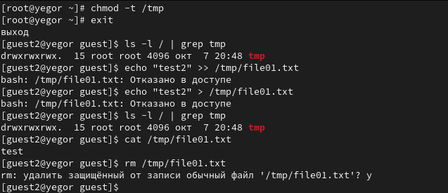{#fig:013 width=90%}

## Вывод

В ходе лабораторной работы мне удалось:

 - Изучить механизмы изменения идентификаторов, применения SetUID- и Sticky-битов. 
 
 - Получить практических навыков работы в консоли с дополнительными атрибутами. 
 
 - Рассмотреть работу механизма смены идентификатора процессов пользователей, а также влияние бита Sticky на запись и удаление файлов.
