---
## Front matter
title: "Отчет по лабораторной работе №5"
subtitle: "по дисциплине: Информационная безопасность"
author: "Логинов Егор Игоревич"

## Generic otions
lang: ru-RU
toc-title: "Содержание"

## Bibliography
bibliography: bib/cite.bib
csl: pandoc/csl/gost-r-7-0-5-2008-numeric.csl

## Pdf output format
toc: true # Table of contents
toc-depth: 2
lof: true # List of figures
lot: false # List of tables
fontsize: 12pt
linestretch: 1.5
papersize: a4
documentclass: scrreprt
## I18n polyglossia
polyglossia-lang:
  name: russian
  options:
	- spelling=modern
	- babelshorthands=true
polyglossia-otherlangs:
  name: english
## I18n babel
babel-lang: russian
babel-otherlangs: english
## Fonts
mainfont: PT Serif
romanfont: PT Serif
sansfont: PT Sans
monofont: PT Mono
mainfontoptions: Ligatures=TeX
romanfontoptions: Ligatures=TeX
sansfontoptions: Ligatures=TeX,Scale=MatchLowercase
monofontoptions: Scale=MatchLowercase,Scale=0.9
## Biblatex
biblatex: true
biblio-style: "gost-numeric"
biblatexoptions:
  - parentracker=true
  - backend=biber
  - hyperref=auto
  - language=auto
  - autolang=other*
  - citestyle=gost-numeric
## Pandoc-crossref LaTeX customization
figureTitle: "Рис."
tableTitle: "Таблица"
listingTitle: "Листинг"
lofTitle: "Список иллюстраций"
lotTitle: "Список таблиц"
lolTitle: "Листинги"
## Misc options
indent: true
header-includes:
  - \usepackage{indentfirst}
  - \usepackage{float} # keep figures where there are in the text
  - \floatplacement{figure}{H} # keep figures where there are in the text
---

# Цели работы

  Изучение механизмов изменения идентификаторов, применения SetUID- и Sticky-битов. Получение практических навыков работы в консоли с дополнительными атрибутами. Рассмотрение работы механизма
смены идентификатора процессов пользователей, а также влияние бита
Sticky на запись и удаление файлов.

# Задание

1. Исследовать SetUID- и SetGID-биты.

2. Исследовать Sticky-бит.

# Теоретическое введение

- Операционная система — это комплекс программ, предназначенных для управления ресурсами компьютера и организации взаимодействия с пользователем [@system].

- Права доступа определяют, какие действия конкретный пользователь может или не может совершать с определенным файлами и каталогами. С помощью разрешений можно создать надежную среду — такую, в которой никто не может поменять содержимое ваших документов или повредить системные файлы. [@root].

# Выполнение лабораторной работы

1. От имени пользователя guest создадим программу simpleid.c, скомпилируем ее и убедимся, что файл создан. Выполним команды ./simpleid и id и убедимся, что полученные данные совпадают (@fig:001).

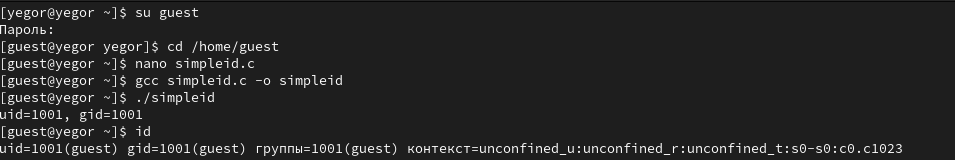{#fig:001 width=90%}


Код программы simpleid.c:

```c
#include <sys/types.h>
#include <unistd.h>
#include <stdio.h>
int
main ()
{
  uid_t uid = geteuid ();
  gid_t gid = getegid ();
  printf ("uid=%d, gid=%d\n", uid, gid);
  return 0;
}
```


2. Усложним программу и запишем ее в файл simpleid2.c. Запустим получившуюся программу и сверим результат с командой id (@fig:002).

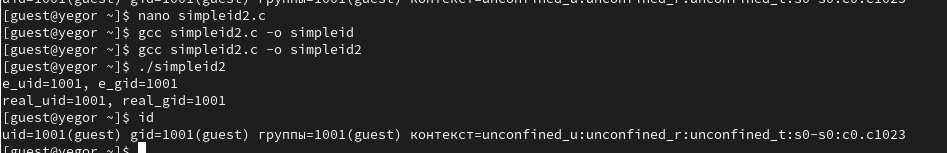{#fig:002 width=90%}


Код программы simpleid2.c:

```c
#include <sys/types.h>
#include <unistd.h>
#include <stdio.h>
int
main ()
{
  uid_t real_uid = getuid ();
  uid_t e_uid = geteuid ();
  gid_t real_gid = getgid ();
  gid_t e_gid = getegid () ;
  printf ("e_uid=%d, e_gid=%d\n", e_uid, e_gid);
  printf ("real_uid=%d, real_gid=%d\n", real_uid, real_gid);
  return 0;
}
```

3. От имени суперпользователя установим новые атрибуты и сменим владельца файла simpleid2 (@fig:003).

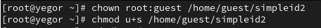{#fig:003 width=90%}


4. Выполним команды ./simpleid2 и id (@fig:004).

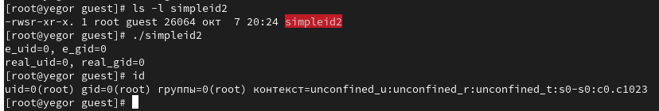{#fig:004 width=90%}


5.  Проделаем то же самое относительно SetGID-бита (@fig:005).

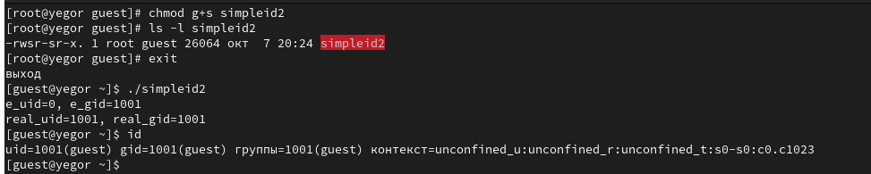{#fig:005 width=90%}


6. Создадим и скомпилируем программу readfile.c. Сменим владельца у файла readfile.c и изменим права так, чтобы только суперпользователь (root) мог прочитать его, a guest не мог (@fig:006).

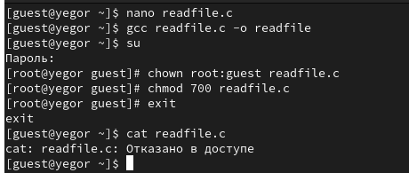{#fig:006 width=90%}


 Пользователь guest не может прочитать файл readfile.c

7. Сменим у программы readfile владельца и установим SetUID-бит (@fig:07).

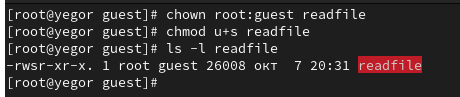{#fig:07 width=90%}


8. Проверим, может ли программа readfile прочитать файл readfile.c (@fig:008).

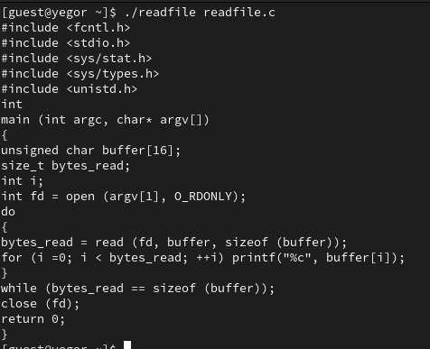{#fig:008 width=90%}


9. Проверим, может ли программа readfile прочитать файл /etc/shadow (@fig:009).

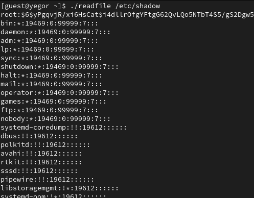{#fig:009 width=90%}


10. Выясним, установлен ли атрибут Sticky на директории /tmp (@fig:010).

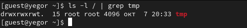{#fig:010 width=90%}


11. От имени пользователя guest создадим файл file01.txt в директории /tmp
со словом test. Просмотрим атрибуты у только что созданного файла и разрешим чтение и запись для категории пользователей «все остальные» (@fig:011).

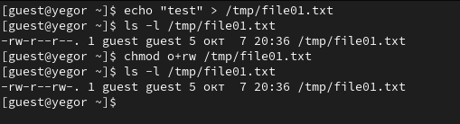{#fig:011 width=90%}


12. От пользователя guest2 попробуем прочитать файл /tmp/file01.txt. Далее попробуем дозаписать в файл /tmp/file01.txt слово test2, записать в файл /tmp/file01.txt слово test3, стерев при этом всю имеющуюся в файле информацию. После этого попробуем удалить данных файл (@fig:012).

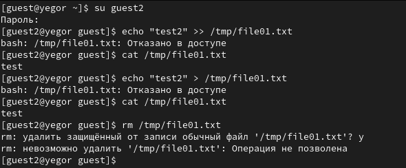{#fig:012 width=90%}

Пользователь guest2 принадлежит группе guest, поэтому у него нет доступа к вышеописанным действиям, так как у группы нет права доступа на запись для данного файла.

13. От имени суперпользователя снимем атрибут t с директории /tmp. От пользователя guest2 проверим, что атрибута t у директории /tmp нет. Повторим предыдущие шаги. Теперь мы можем удалить файл. (@fig:013).

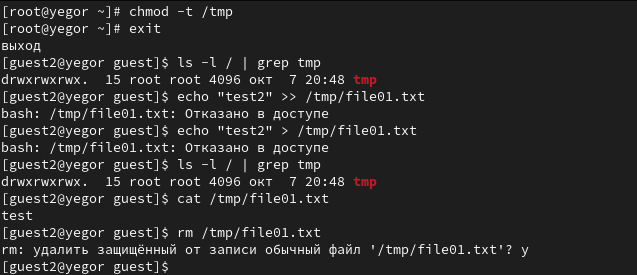{#fig:013 width=90%}

# Выводы

 В рамках данной лабораторной работы были изучены механизмы изменения идентификаторов, применения SetUID- и Sticky-битов. Получены практические навыков работы в консоли с дополнительными атрибутами. Рассмотрены принципы работы механизма смены идентификатора процессов пользователей, а также влияние бита Sticky на запись и удаление файлов.


# Список литературы

::: {#refs}
:::
