---
## Front matter
lang: ru-RU
title: Лабораторная работа №6
subtitle: Мандатное разграничение прав в Linux
author:
  - Логинов Егор Игоревич
institute:
  - Российский университет дружбы народов, Москва, Россия
date: 13 октября 2023

## i18n babel
babel-lang: russian
babel-otherlangs: english

## Formatting pdf
toc: false
toc-title: Содержание
slide_level: 2
aspectratio: 169
section-titles: true
theme: metropolis
header-includes:
 - \metroset{progressbar=frametitle,sectionpage=progressbar,numbering=fraction}
 - '\makeatletter'
 - '\beamer@ignorenonframefalse'
 - '\makeatother'
---

# Информация

## Докладчик

:::::::::::::: {.columns align=center}
::: {.column width="70%"}

  * Логинов Егор Игоревич
  * студент НФИбд-01-20
  * Российский университет дружбы народов
  * [1032201661@pfur.ru](mailto:1032201661@pfur.ru)
  * <https://github.com/Y0gu4t>

:::
::::::::::::::

# Вводная часть

## Актуальность

Логические объекты файловой системы (файлы) являются носителями своеобразных меток, которые привычно называют правами доступа. Некоторые метки действительно означают право выполнения определенного действия пользователя над этим объектом. Важно изучить их для дальнейшего применения на практике.

## Объект и предмет исследования

- Атрибуты файлов
- Дистрибутив Rocky
- Дискреционное разграничение доступа

## Цели и задачи

Развить навыки администрирования ОС Linux. Получить первое практическое знакомство с технологией SELinux1. Проверить работу SELinx на практике совместно с веб-сервером
Apache.

# Выполнение работы

## Ход работы

Войдем в систему с полученными учётными данными и убедимся, что
SELinux работает в режиме enforcing политики targeted

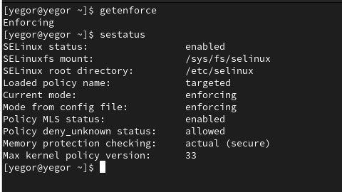{#fig:001 width=70%}

## Ход работы

Обратимся с помощью браузера к веб-серверу, запущенному на нашем
компьютере, и убедимся, что последний работает

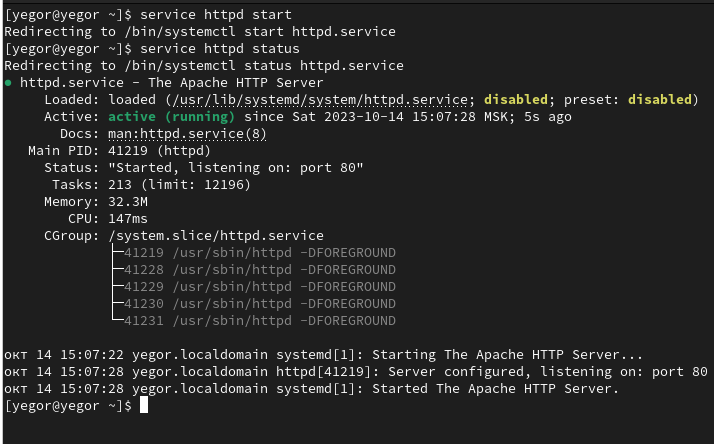{#fig:002 width=70%}

## Ход работы

Найдем веб-сервер Apache в списке процессов, определим его контекст
безопасности 

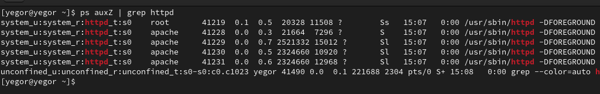{#fig:003 width=70%}

## Ход работы

Посмотрим текущее состояние переключателей SELinux для Apache

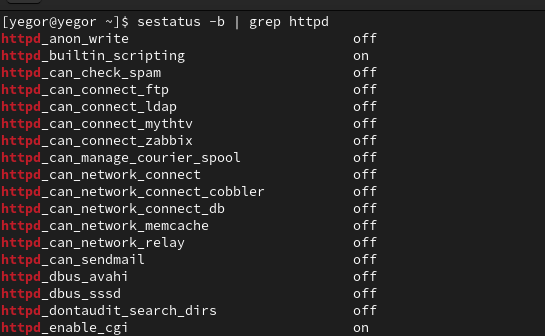{#fig:004 width=70%}

## Ход работы

Посмотрим статистику по политике с помощью команды seinfo

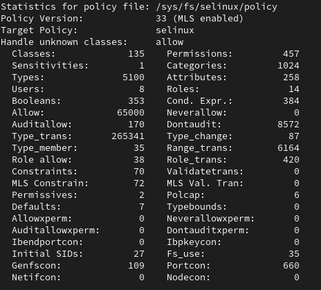{#fig:005 width=70%}

## Ход работы

Определим тип файлов и поддиректорий, находящихся в директориях
/var/www и /var/www/html. Определим круг пользователей, которым разрешено создание файлов в директории /var/www/html

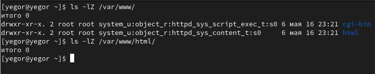{#fig:006 width=70%}

## Ход работы

Создадим от имени суперпользователя html-файл /var/www/html/test.html. Проверим контекст созданного нами файла 

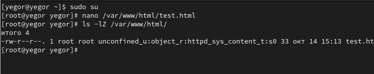{#fig:007 width=70%}

Как видим по умолчанию присваивается контекст _unconfined_u:object_r:httpd_sys_content_t:s0_

## Ход работы

Обратимся к файлу через веб-сервер, введя в браузере адрес
http://127.0.0.1/test.html. Убедимся, что файл был успешно отображён

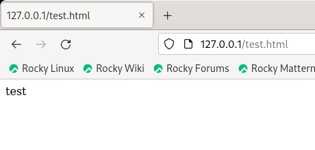{#fig:008 width=70%}

## Ход работы

Изучим справку man httpd_selinux и выясним, какие контексты файлов определены для httpd. Сопоставим их с типом файла test.html

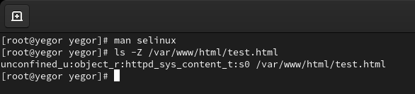{#fig:009 width=70%}

## Ход работы

Изменим контекст файла /var/www/html/test.html с httpd_sys_content_t на samba_share_t

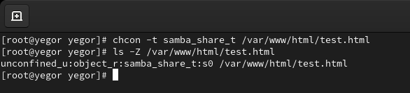{#fig:010 width=70%}

## Ход работы

Попробуем ещё раз получить доступ к файлу через веб-сервер

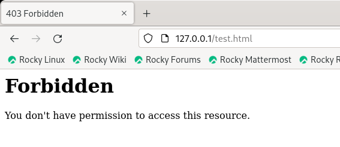{#fig:011 width=70%}

## Ход работы

Просмотрим log-файлы веб-сервера Apache и системный лог-файл

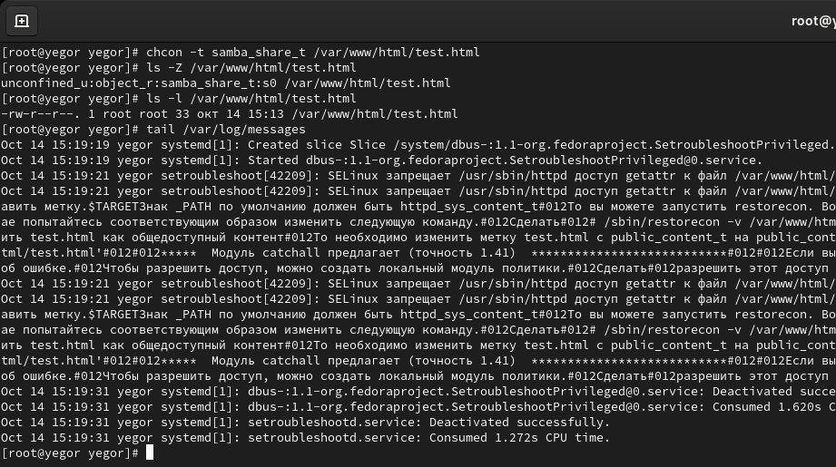{#fig:012 width=70%}

Как видим, нам не удалось получить доступ к файлу как раз из-за измененного контекста.

## Ход работы

Попробуем запустить веб-сервер Apache на прослушивание ТСР-порта 81. Выполним перезапуск веб-сервера. Сбоя не произошло

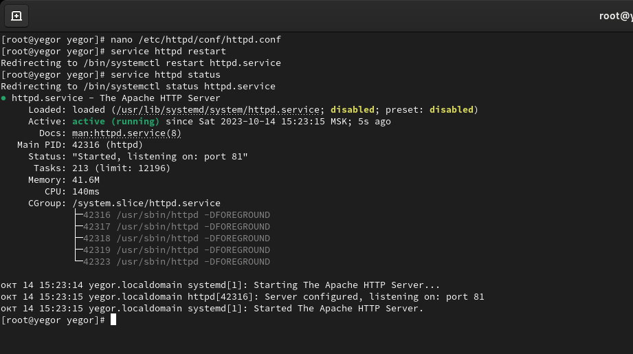{#fig:013 width=70%}

## Ход работы

Проанализируем лог-файлы

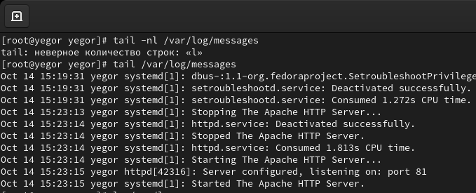{#fig:014 width=70%}

## Ход работы

Выполним команду semanage port -a -t http_port_t -р tcp 81. После этого проверим список портов командой semanage port -l | grep http_port_t
Убедимся, что порт 81 есть в списке.

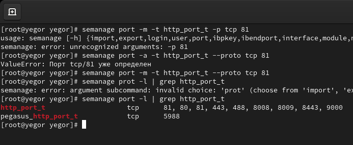{#fig:015 width=70%}

## Ход работы

Попробуем запустить веб-сервер Apache ещё раз. Вернем контекст httpd_sys_cоntent__t к файлу /var/www/html/ test.html. Попробуем получить доступ к файлу через веб-сервер

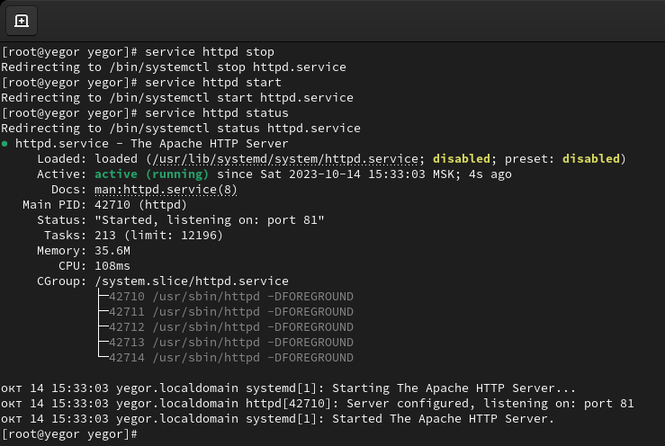{#fig:016 width=70%}

## Ход работы

Исправим обратно конфигурационный файл apache, вернув Listen 80. Попробуем удалить привязку http_port_t к 81. Удалим файл /var/www/html/test.html

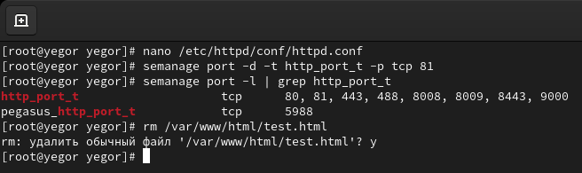{#fig:017 width=70%}

## Вывод

- В рамках данной лабораторной работы были развиты навыки администрирования ОС Linux
- Получено первое практическое знакомство с технологией SELinux1. Проверена работа SELinx на практике совместно с веб-сервером Apache