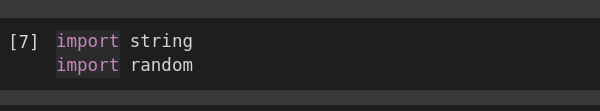
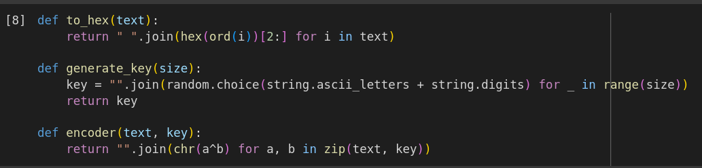
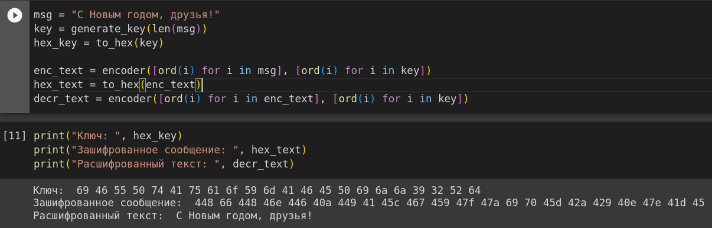
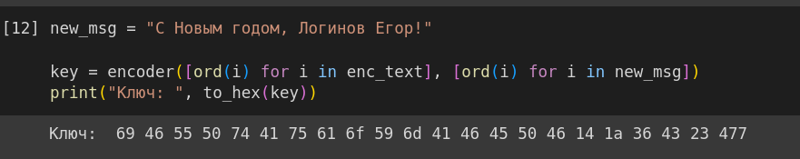

---
## Front matter
title: "Отчет по лабораторной работе №7"
subtitle: "по дисциплине: Информационная безопасность"
author: "Логинов Егор Игоревич"

## Generic otions
lang: ru-RU
toc-title: "Содержание"

## Bibliography
bibliography: bib/cite.bib
csl: pandoc/csl/gost-r-7-0-5-2008-numeric.csl

## Pdf output format
toc: true # Table of contents
toc-depth: 2
lof: true # List of figures
lot: false # List of tables
fontsize: 12pt
linestretch: 1.5
papersize: a4
documentclass: scrreprt
## I18n polyglossia
polyglossia-lang:
  name: russian
  options:
	- spelling=modern
	- babelshorthands=true
polyglossia-otherlangs:
  name: english
## I18n babel
babel-lang: russian
babel-otherlangs: english
## Fonts
mainfont: PT Serif
romanfont: PT Serif
sansfont: PT Sans
monofont: PT Mono
mainfontoptions: Ligatures=TeX
romanfontoptions: Ligatures=TeX
sansfontoptions: Ligatures=TeX,Scale=MatchLowercase
monofontoptions: Scale=MatchLowercase,Scale=0.9
## Biblatex
biblatex: true
biblio-style: "gost-numeric"
biblatexoptions:
  - parentracker=true
  - backend=biber
  - hyperref=auto
  - language=auto
  - autolang=other*
  - citestyle=gost-numeric
## Pandoc-crossref LaTeX customization
figureTitle: "Рис."
tableTitle: "Таблица"
listingTitle: "Листинг"
lofTitle: "Список иллюстраций"
lotTitle: "Список таблиц"
lolTitle: "Листинги"
## Misc options
indent: true
header-includes:
  - \usepackage{indentfirst}
  - \usepackage{float} # keep figures where there are in the text
  - \floatplacement{figure}{H} # keep figures where there are in the text
---

# Цель работы

Освоить на практике применение режима однократного гаммирования.

# Задание

Нужно подобрать ключ, чтобы получить сообщение «С Новым Годом,
друзья!». Требуется разработать приложение, позволяющее шифровать и
дешифровать данные в режиме однократного гаммирования. Приложение
должно:

1. Определить вид шифротекста при известном ключе и известном открытом тексте.
2. Определить ключ, с помощью которого шифротекст может быть преобразован в некоторый фрагмент текста, представляющий собой один из
возможных вариантов прочтения открытого текста.

# Теоретическое введение

- Шифрование – это технология кодирования и раскодирования данных.Зашифрованные данные -это результат применения алгоритма для кодирования данных с целью сделать их недоступными для чтения. Данные могут быть раскодированы в исходную форму только путем применения специальный ключа [@encryption].
- Гаммирование — это наложение (или снятие при расшифровке сообщений) на открытое (или зашифрованное) сообщение так называемой криптографической гаммы. Криптографическая гамма — это последовательность элементов данных, которая вырабатывается с помощью определенного алгоритма. [@gamma].

# Выполнение лабораторной работы

1. Импортируем необходимые модули (@fig:001).

{#fig:001 width=90%}

2. Создадим функции для преобразования данных в шестнадцатеричный формат, генерации ключа и кодирования, декодирования данных (@fig:002).

{#fig:002 width=90%}

3. Закодируем и декодируем строку "С Новым годом, друзья!" (@fig:003).

{#fig:003 width=90%}

4. Получим ключ, с помощью которого получим сообщение "С Новым годом, Логинов Егор" вместо "С Новым годом, друзья!" при декодировании. Воспользуемся симметричностью кодирования(@fig:004).

{#fig:004 width=90%}

# Выводы

В рамках данной лабораторной работы было освоено на практике применение режима однократного гаммирования.

# Список литературы

::: {#refs}
:::
