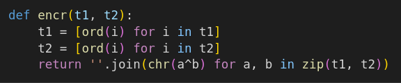
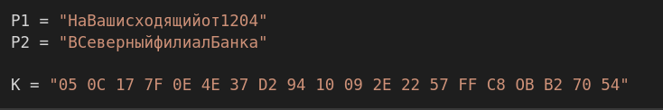
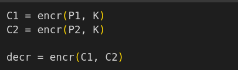
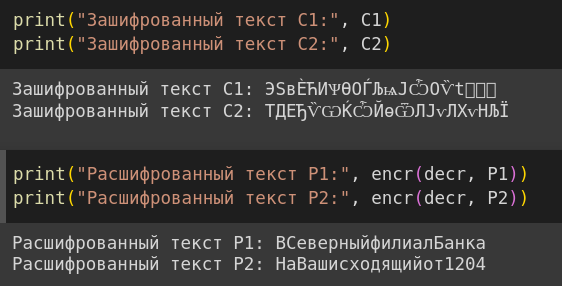

---
## Front matter
lang: ru-RU
title: Лабораторная работа №8
subtitle: Элементы криптографии. Шифрование (кодирование) различных исходных текстов одним ключом
author:
  - Логинов Егор Игоревич
institute:
  - Российский университет дружбы народов, Москва, Россия
date: 28 октября 2023

## i18n babel
babel-lang: russian
babel-otherlangs: english

## Formatting pdf
toc: false
toc-title: Содержание
slide_level: 2
aspectratio: 169
section-titles: true
theme: metropolis
header-includes:
 - \metroset{progressbar=frametitle,sectionpage=progressbar,numbering=fraction}
 - '\makeatletter'
 - '\beamer@ignorenonframefalse'
 - '\makeatother'
---

# Информация

## Докладчик

:::::::::::::: {.columns align=center}
::: {.column width="70%"}

  * Логинов Егор Игоревич
  * студент НФИбд-01-20
  * Российский университет дружбы народов
  * [1032201661@pfur.ru](mailto:1032201661@pfur.ru)
  * <https://github.com/Y0gu4t>

:::
::::::::::::::

# Вводная часть

## Цели

Освоить на практике применение режима однократного гаммирования на примере кодирования различных исходных текстов одним ключом.

## Выполнение работы

 Создаем функцию шифрования (@fig:001).

{#fig:001 width=90%}

## Выполнение работы

Введем данные из условия (@fig:002).

{#fig:002 width=90%}

## Выполнение работы

Зашифруем текст с помощью ключа К. Создадим последовательность, с помощью которой будем расшифровывать текст. Передадим ее в функцию шифрования вместе с зашифрованным текстом. (@fig:003).

{#fig:003 width=90%}

## Выполнение работы

Запустим программу и получим результат (@fig:004).

{#fig:004 width=90%}

## Вывод

В рамках данной лабораторной работы было освоено на практике применение режима однократного гаммирования на примере кодирования различных исходных текстов одним ключом.

